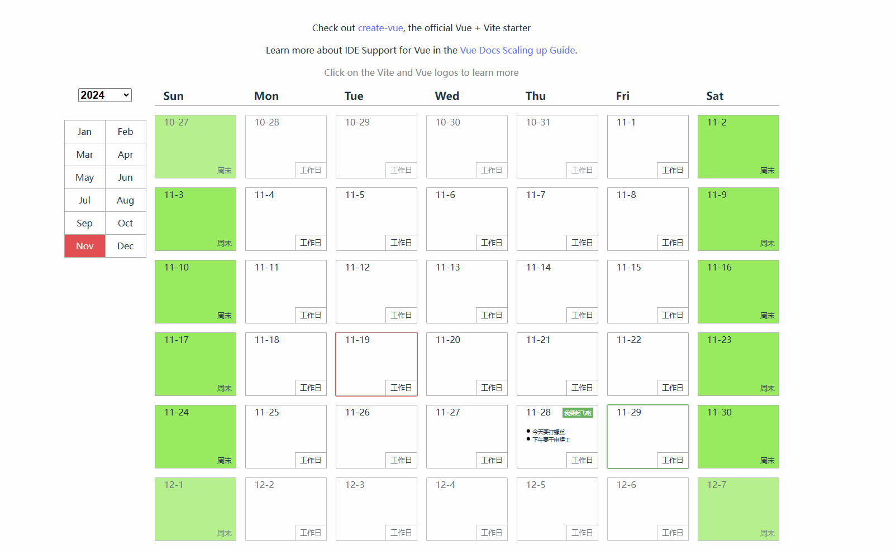

# 一个简化版的日历组件

## 环境要求
- nodejs lts 20
- vscode or webstrom

## 依赖
- vue3 框架
- 使用了 dayjs 来支持方便的日期计算
## 功能
- 已经添加了项目级的依赖源配置`.npmrc`，可以加速下载依赖。
- 实现了简单的日历展示；
- 实现了对外部输入的任务信息附加到日历上，简化版的outlook 日历选项卡；
- 点击对应的天，可以对外（父级）响应事件，将那一天的信息暴露出来；

## 如何引用
参照 `src/App.vue`中 `calendar` 的写法
## 组件代码原始路径
[代码路径](./src/components/Calendar.vue)
## 演示动图

## 快速验证
- 编译、打包； `pnpm i && pnpm run build`
- 如果是打包后的请在 `/dist `中找到 index.html 在浏览器中打开
## 未尽功能
- 未对信息长度进行裁剪，可能会过长
- 针对任务信息列表过长未进行裁剪